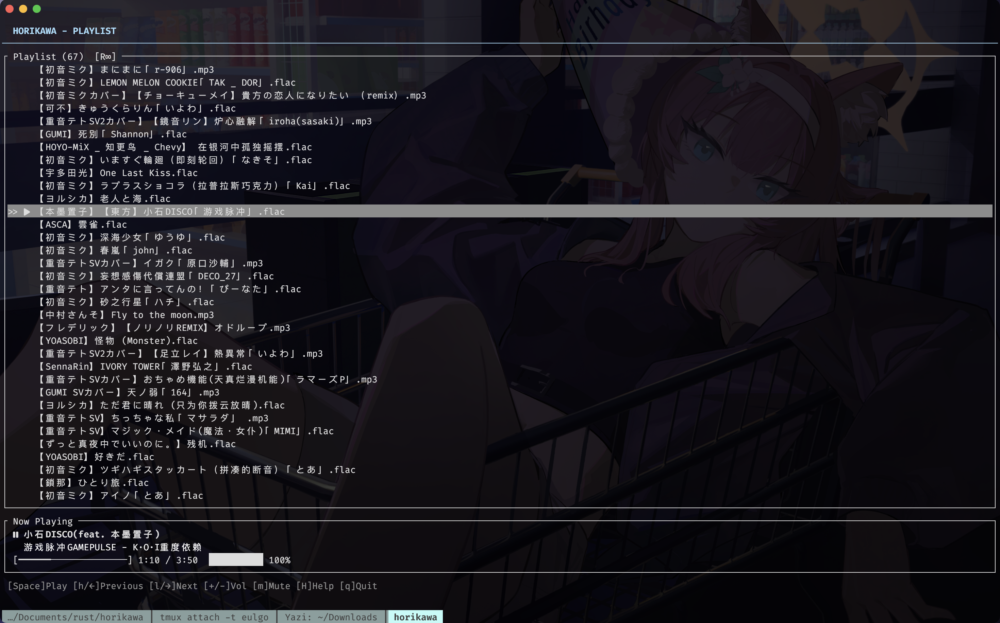
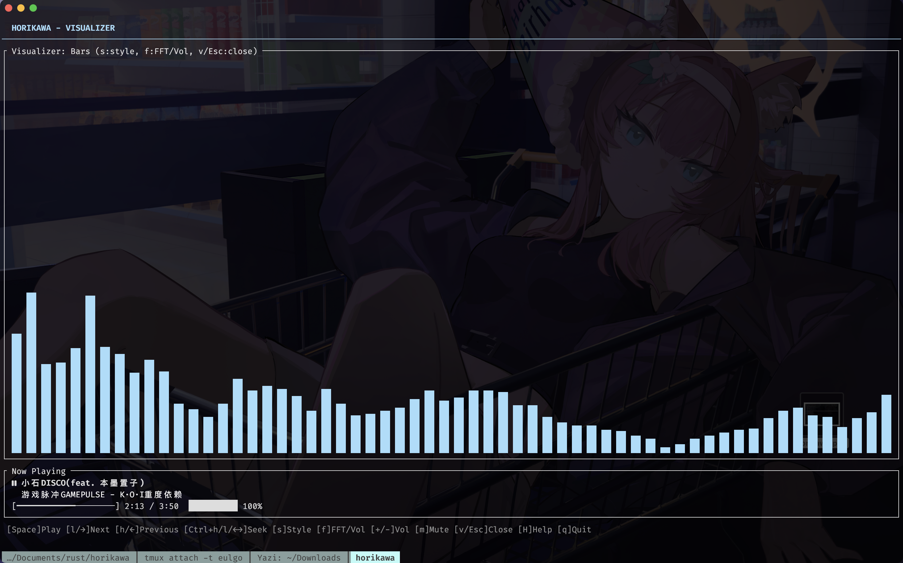
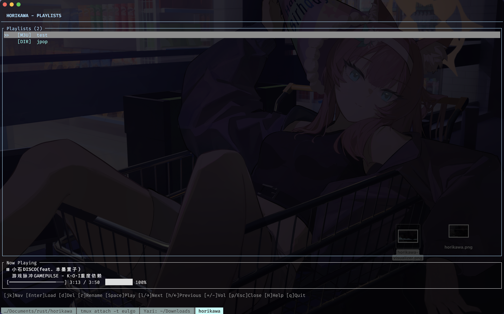

# Horikawa

基于 Rust 的轻量级终端音乐播放器。


> 堀川雷鼓「让一切跟上节奏程度的能力」。

## 功能

- **音频播放** — 播放、暂停、跳转、音量控制、上一首/下一首
- **多格式支持** — MP3、FLAC、OGG、WAV、M4A/AAC、OPUS、WMA、AIFF、ALAC
- **频谱可视化** — 柱状图、频谱图、波形图、电平表（~30 FPS）
- **播放列表管理** — M3U 和目录型（.horikawa）播放列表，随机、循环、排序、去重
- **文件浏览器** — 浏览本地目录，添加文件/文件夹，一键保存为歌单
- **歌单视图** — 浏览、加载、删除、重命名已保存的歌单
- **弹窗对话框** — 输入弹窗命名歌单，确认弹窗防止误删
- **快捷键帮助** — `H` 键显示当前视图的快捷键
- **Vim 风格键位** — `h/j/k/l` 导航和播放控制
- **会话持久化** — 记住歌单、播放位置、音量、设置
- **斜杠命令** — `/playlist`、`/dirplaylist`、`/queue`、`/goto`、`/seek`、`/reload` 等
- **平台集成**
  - macOS：控制中心「正在播放」、媒体键
  - Linux：MPRIS D-Bus（KDE/GNOME 媒体控制）
  - Windows：系统媒体传输控制（锁屏、媒体键）
  - Discord Rich Presence

## 截图







## 安装

### 从源码编译

**前置条件：**
- Rust 1.70+
- Linux：ALSA 开发头文件（Debian/Ubuntu 下的 `libasound2-dev`）

```bash
git clone https://github.com/youyoEulgo/horikawa.git
cd horikawa
cargo build --release
```

编译好的二进制在 `target/release/horikawa`。

**需要 Nerd Font** 才能正常显示图标（文件夹、音频、播放/暂停/停止）。推荐使用 [FiraCode Nerd Font](https://github.com/ryanoasis/nerd-fonts/tree/master/patched-fonts/FiraCode) 或任意其他 Nerd Font。

## 使用

```bash
# 启动并打开文件浏览器
horikawa --browse

# 打开指定目录
horikawa --path /path/to/music

# 播放指定文件
horikawa track1.mp3 track2.flac

# 播放目录下所有音频
horikawa /path/to/music/

# 作为无界面守卫进程运行（不启动 TUI）
horikawa --daemon
```

## 快捷键

### 播放列表

| 键             | 功能                                |
| -------------- | ----------------------------------- |
| `Space`        | 播放 / 暂停                         |
| `h` / `←`      | 上一首                              |
| `l` / `→`      | 下一首                              |
| `Enter`        | 播放选中的曲目                      |
| `k` / `↑`      | 向上移动选择                        |
| `j` / `↓`      | 向下移动选择                        |
| `g` / `Home`   | 跳到第一首                          |
| `G` / `End`    | 跳到最后一首                        |
| `+` / `-`      | 音量增大 / 减小                     |
| `m`            | 静音 / 取消静音                     |
| `s`            | 保存当前列表为 M3U 歌单（弹窗命名） |
| `S`            | 切换随机播放                        |
| `r`            | 循环模式（关 → 单曲 → 全部）        |
| `R`            | 重新加载上次的歌单                  |
| `Ctrl+h` / `←` | 后退 10 秒                          |
| `Ctrl+l` / `→` | 前进 10 秒                          |

编辑模式（按 `e` 进入）：

| 键                    | 功能                      |
| --------------------- | ------------------------- |
| `e`                   | 切换编辑模式              |
| `Shift+j` / `Shift+k` | 将选中曲目向下 / 向上移动 |
| `d`                   | 删除选中的曲目            |
| `c`                   | 清空整个播放列表          |

视图：

| 键                  | 功能                |
| ------------------- | ------------------- |
| `Tab` / `Shift+Tab` | 下一个 / 上一个视图 |
| `v`                 | 打开可视化器        |
| `p`                 | 打开歌单视图        |
| `b`                 | 打开文件浏览器      |
| `i`                 | 打开曲目信息        |

其他：

| 键  | 功能                       |
| --- | -------------------------- |
| `/` | 进入斜杠命令模式           |
| `H` | 显示播放列表快捷键帮助弹窗 |
| `q` | 退出                       |

### 文件浏览器

| 键                      | 功能                                     |
| ----------------------- | ---------------------------------------- |
| `h` / `←` / `Backspace` | 返回上级目录                             |
| `l` / `→` / `Enter`     | 进入目录，或播放文件（不在列表则先加入） |
| `k` / `↑`               | 向上移动选择                             |
| `j` / `↓`               | 向下移动选择                             |
| `a`                     | 添加选中文件或文件夹到列表（跳过重复）   |
| `Enter`                 | 进入目录，或播放文件（不在列表则先加入） |
| `s`                     | 将选中目录保存为 M3U 歌单（弹窗命名）    |
| `S`                     | 将选中目录保存为 .horikawa 目录型歌单    |
| `.`                     | 切换隐藏文件（.dotfiles）的显示          |
| `R`                     | 刷新目录列表                             |
| `~`                     | 回到主目录                               |
| `g` / `Home`            | 跳到第一条                               |
| `G` / `End`             | 跳到最后一条                             |

视图：

| 键                  | 功能                |
| ------------------- | ------------------- |
| `Tab` / `Shift+Tab` | 下一个 / 上一个视图 |
| `v`                 | 打开可视化器        |
| `p`                 | 打开歌单视图        |
| `b` / `Esc`         | 返回播放列表        |
| `i`                 | 打开曲目信息        |

其他：

| 键  | 功能                     |
| --- | ------------------------ |
| `/` | 进入斜杠命令模式         |
| `H` | 显示浏览器快捷键帮助弹窗 |
| `q` | 退出                     |

### 歌单视图

| 键        | 功能                       |
| --------- | -------------------------- |
| `Enter`   | 加载选中的歌单             |
| `d`       | 删除选中歌单（确认弹窗）   |
| `r`       | 重命名选中歌单（输入弹窗） |
| `Space`   | 播放 / 暂停                |
| `k` / `↑` | 向上移动选择               |
| `j` / `↓` | 向下移动选择               |
| `+` / `-` | 音量增大 / 减小            |
| `h` / `←` | 上一首                     |
| `l` / `→` | 下一首                     |
| `m`       | 静音 / 取消静音            |

视图：

| 键                  | 功能                |
| ------------------- | ------------------- |
| `Tab` / `Shift+Tab` | 下一个 / 上一个视图 |
| `v`                 | 打开可视化器        |
| `p` / `Esc`         | 返回播放列表        |
| `b`                 | 打开文件浏览器      |
| `i`                 | 打开曲目信息        |

其他：

| 键  | 功能                   |
| --- | ---------------------- |
| `/` | 进入斜杠命令模式       |
| `H` | 显示歌单快捷键帮助弹窗 |
| `q` | 退出                   |

### 曲目信息

| 键             | 功能            |
| -------------- | --------------- |
| `Space`        | 播放 / 暂停     |
| `h` / `←`      | 上一首          |
| `l` / `→`      | 下一首          |
| `Ctrl+h` / `←` | 后退 10 秒      |
| `Ctrl+l` / `→` | 前进 10 秒      |
| `+` / `-`      | 音量增大 / 减小 |
| `m`            | 静音 / 取消静音 |

视图：

| 键                  | 功能                |
| ------------------- | ------------------- |
| `Tab` / `Shift+Tab` | 下一个 / 上一个视图 |
| `v`                 | 打开可视化器        |
| `p`                 | 打开歌单视图        |
| `b`                 | 打开文件浏览器      |
| `i` / `Esc`         | 返回播放列表        |

其他：

| 键  | 功能                       |
| --- | -------------------------- |
| `/` | 进入斜杠命令模式           |
| `H` | 显示曲目信息快捷键帮助弹窗 |
| `q` | 退出                       |

### 可视化器

| 键             | 功能                                      |
| -------------- | ----------------------------------------- |
| `s`            | 切换样式（柱状图 → 频谱 → 波形 → 电平表） |
| `f`            | 切换 FFT 频谱 / RMS 音量表                |
| `Space`        | 播放 / 暂停                               |
| `h` / `←`      | 上一首                                    |
| `l` / `→`      | 下一首                                    |
| `Ctrl+h` / `←` | 后退 10 秒                                |
| `Ctrl+l` / `→` | 前进 10 秒                                |
| `+` / `-`      | 音量增大 / 减小                           |
| `m`            | 静音 / 取消静音                           |

视图：

| 键                  | 功能                |
| ------------------- | ------------------- |
| `Tab` / `Shift+Tab` | 下一个 / 上一个视图 |
| `v` / `Esc`         | 返回播放列表        |
| `p`                 | 打开歌单视图        |
| `b`                 | 打开文件浏览器      |
| `i`                 | 打开曲目信息        |

其他：

| 键  | 功能                       |
| --- | -------------------------- |
| `/` | 进入斜杠命令模式           |
| `H` | 显示可视化器快捷键帮助弹窗 |
| `q` | 退出                       |

### 设置

| 键        | 功能             |
| --------- | ---------------- |
| `Enter`   | 切换选中的设置项 |
| `k` / `↑` | 向上移动选择     |
| `j` / `↓` | 向下移动选择     |
| `Space`   | 播放 / 暂停      |
| `h` / `←` | 上一首           |
| `l` / `→` | 下一首           |
| `+` / `-` | 音量增大 / 减小  |
| `m`       | 静音 / 取消静音  |

其他：

| 键    | 功能                   |
| ----- | ---------------------- |
| `/`   | 进入斜杠命令模式       |
| `Esc` | 返回播放列表           |
| `H`   | 显示设置快捷键帮助弹窗 |
| `q`   | 退出                   |

### 帮助

| 键        | 功能     |
| --------- | -------- |
| `j` / `↓` | 向下滚动 |
| `k` / `↑` | 向上滚动 |
| `PgDn`    | 向下翻页 |
| `PgUp`    | 向上翻页 |

其他：

| 键          | 功能               |
| ----------- | ------------------ |
| `/`         | 进入斜杠命令模式   |
| `Esc` / `?` | 关闭帮助           |
| `H`         | 显示帮助快捷键弹窗 |
| `q`         | 退出               |

## 视图

按 **Tab** / **Shift+Tab** 循环切换视图：

```
播放列表 → 浏览器 → 歌单 → 曲目信息 → 可视化器 → 设置
```

从播放列表视图快速跳转：`b` 浏览器、`p` 歌单、`i` 曲目信息、`v` 可视化器。

## 斜杠命令

按 `/` 进入命令模式，可使用以下命令：

### 队列

| 命令                | 别名    | 功能                 |
| ------------------- | ------- | -------------------- |
| `/queue add <路径>` | `/q a`  | 将文件或目录加入队列 |
| `/queue remove`     | `/q rm` | 移除选中曲目         |
| `/queue clear`      | `/q cl` | 清空队列             |
| `/queue dedup`      | `/q dedup` | 移除重复曲目         |

### 播放列表

| 命令                      | 别名       | 功能               |
| ------------------------- | ---------- | ------------------ |
| `/playlist save <名称>`   | `/pl save` | 保存当前列表为 M3U |
| `/playlist load <名称>`   | `/pl load` | 加载已保存的歌单   |
| `/playlist list`          | `/pl ls`   | 列出已保存的歌单   |
| `/playlist delete <名称>` | `/pl del`  | 删除已保存的歌单   |

### 目录歌单

| 命令                              | 别名          | 功能                            |
| --------------------------------- | ------------- | ------------------------------- |
| `/dirplaylist save <名称> [目录]` | `/dirpl save` | 将目录保存为歌单（`.horikawa`） |
| `/dirplaylist load <名称>`        | `/dirpl load` | 加载并扫描目录歌单              |
| `/dirplaylist list`               | `/dirpl ls`   | 列出已保存的目录歌单            |
| `/dirplaylist delete <名称>`      | `/dirpl del`  | 删除目录歌单                    |

### 导航与播放

| 命令                      | 功能                        |
| ------------------------- | --------------------------- |
| `/goto <路径>`            | 浏览器跳转到路径            |
| `/search <关键词>`        | 过滤当前视图                |
| `/home`                   | 回到主目录                  |
| `/seek <时间>`            | 跳转到指定位置（如 `1:30`） |
| `/shuffle`                | 切换随机播放                |
| `/repeat [off\|one\|all]` | 设置循环模式                |
| `/vol [0-100]`            | 设置或显示音量              |
| `/reload`                 | 重新加载上次歌单            |
| `/vis`                    | 切换可视化器                |
| `/help`                   | 显示帮助                    |
| `/quit`                   | 退出应用                    |

## 配置

设置存储在：
- Linux/macOS：`~/.config/horikawa/settings.json`
- Windows：`%APPDATA%\horikawa\settings.json`

歌单存储在：
- Linux：`~/.local/share/horikawa/playlists/`
- macOS：`~/Library/Application Support/horikawa/playlists/`
- Windows：`Music/Horikawa/`

```json
{
  "discord_enabled": true,
  "smtc_enabled": true
}
```

## 编译

### 本地编译

```bash
cargo build --release
```

## 许可证

MIT
